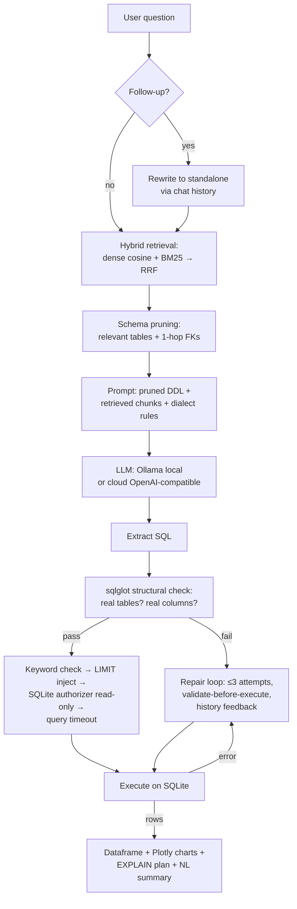

# ⚡ SQL RAG Studio — Natural Language to SQL

A high-performance, fully local **Retrieval-Augmented Generation (RAG) SQL Engine** powered by local LLMs (**Ollama**) and hybrid semantic vector indexing — with an optional cloud-LLM mode for hosted demos.

Translate complex natural language questions into accurate, performant, and safe SQLite queries with instant visual analytics, AI auto-repair, and interactive database exploration.

---

## 🚀 Key Features

- **Local LLM Inference**: 100% private, free local execution via Ollama (`llama3.1`, `qwen`, `deepseek-r1`, `mistral`, etc.).
- **Cloud LLM Mode**: optional OpenAI-compatible endpoint (e.g. Gemini) so the app can run on Streamlit Cloud where Ollama can't. API keys stay in memory / `st.secrets`, never in code.
- **True Hybrid Retrieval**: dense cosine similarity **and** BM25 keyword search run independently, fused with **Reciprocal Rank Fusion (RRF)** — exact name matches and semantic matches reinforce each other.
- **Load-Bearing Schema Pruning**: hybrid retrieval selects the relevant tables first (plus one-hop FK neighbors) and only those tables' DDL is injected into the prompt. This is what lets the engine scale past toy schemas to databases with hundreds of tables.
- **Persistent Vector Index**: the built index is cached on disk and reloaded when the DB file is unchanged (mtime check) — restarts skip re-embedding.
- **Layered Safety Guardrails**: keyword validation **plus** a SQLite authorizer callback that denies writes at the engine level, a progress-handler query timeout against runaway JOINs, and automatic `LIMIT` injection so the LLM can't dump a whole table.
- **Structural SQL Validation (sqlglot)**: generated SQL is parsed and every table/column is checked against the real schema *before* execution — catches hallucinated names, the #1 text-to-SQL failure mode.
- **AI Self-Correction / Auto-Repair**: up to 3 repair attempts; each candidate is structurally validated before execution and prior failures feed back into the prompt so the model doesn't repeat mistakes.
- **Conversational Follow-ups**: follow-up questions ("now only 2023") are rewritten into standalone questions against chat history.
- **Natural Language Summaries**: executive plain-English insights from query results.
- **Interactive Plotly Visualizations** with automatic chart recommendation, plus an **EXPLAIN QUERY PLAN** viewer.
- **Execution-Accuracy Evals**: a 25-question golden set scored by execution match (result sets, not SQL strings) — `python -m evals.run_evals`.
- **Multi-Source Database Management**: sample DB, custom SQLite upload, CSV ingestion, or a Faker-generated 17k-row `large_sample.db` for scale demos (`python scripts/generate_large_sample.py`).
- **In-Place SQL Editor & History** with per-query repair-attempt traces.

---

## 📦 Quick Start

### 1. Prerequisites
- **Python 3.10+**
- **Ollama**: [Download & Install Ollama](https://ollama.com/download)

### 2. Pull Ollama Models
```bash
# Pull LLM for SQL generation
ollama pull llama3.1

# (Optional) Pull embedding model for dense vector search
ollama pull nomic-embed-text
```

### 3. Install Dependencies
```bash
pip install -r requirements.txt
```
*(Or run `setup.bat` on Windows)*

### 4. Run Test Suite
```bash
python -m pytest -v
```

### 5. Launch the Studio
```bash
streamlit run app.py
```

---

## 🏗️ Architecture



---

## 📊 Sample Database Schema

The built-in sample database contains 4 interconnected enterprise tables:
1. `departments`: id, name, budget, location, created_at
2. `employees`: id, name, department_id, role, salary, hire_date, city, email, performance_rating
3. `projects`: id, name, department_id, lead_id, budget, status, start_date, end_date
4. `sales_transactions`: id, employee_id, customer_name, product_category, amount, units_sold, transaction_date, region

Need scale? Generate a 17k-row version with the same schema:

```bash
python scripts/generate_large_sample.py          # -> data/large_sample.db
python scripts/generate_large_sample.py --employees 5000 --sales 50000 --db data/big.db
```

---

## 🧪 Testing

```bash
# Unit + integration tests (e2e auto-skips if Ollama isn't running)
python -m pytest -v
```

---

## 📏 Evaluation (execution accuracy)

`evals/` holds a 25-question golden set over the sample DB. The metric is
**execution match**: the generated SQL scores iff it returns the same rows as
the golden answer (order-insensitive) — many different queries can be correct,
so comparing SQL strings would be dishonest.

```bash
python -m evals.run_evals --mock            # harness self-test, no LLM (expect 25/25)
python -m evals.run_evals --model llama3.1  # real run via Ollama
python -m evals.run_evals --provider cloud  # real run via cloud endpoint (needs key)
```

| Run | Score |
|---|---|
| Harness self-test (`--mock`) | 25/25 (100%) |
| llama3.1 via Ollama | run `python -m evals.run_evals` and fill in |

---

## ☁️ Cloud LLM mode (hosted demo)

Ollama can't run on Streamlit Cloud, so the sidebar offers a **Cloud
(OpenAI-compatible)** provider: point it at any `/chat/completions` endpoint
(Gemini's OpenAI-compatible URL is the default, model `gemini-flash-latest`)
and paste the key — or set `LLM_API_KEY` / `LLM_BASE_URL` / `LLM_MODEL` in
Streamlit Secrets. Keys live in memory only and are never logged.

---

## 📈 How it scales

The retrieval is load-bearing, not decorative: the full schema is only dumped
into the prompt for small databases (≤5 tables). Beyond that, hybrid
dense+BM25 retrieval picks the relevant tables, expands one hop along foreign
keys so joins don't lose a table, and only that pruned DDL reaches the LLM.
The vector index persists to `data/index_cache/` and rebuilds only when the DB
file changes.

---

## 🛡️ License

MIT License. Free and open source.
